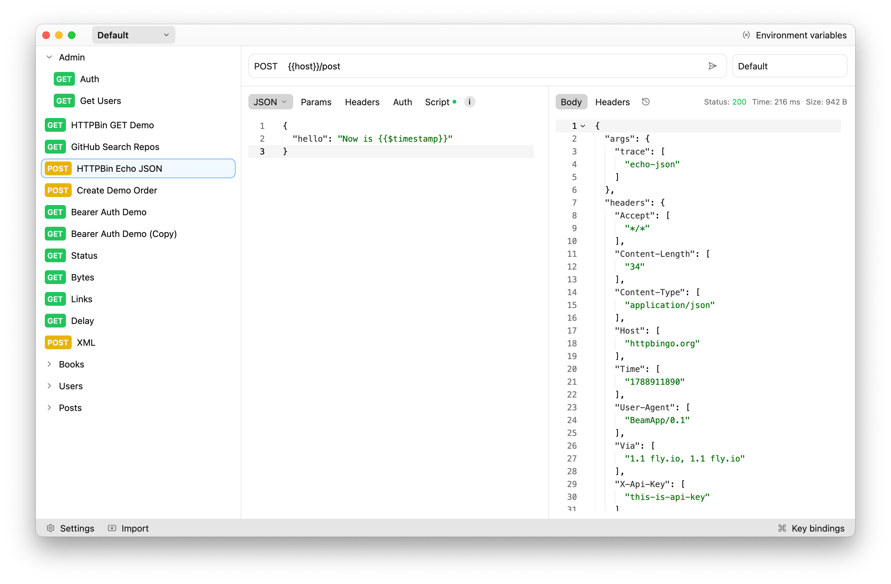

# Beam

A HTTP client for developers built with Rust and Iced.



## Features

- 🚀 Fast and lightweigh
- 📁 Request collections
- 🔐 Multiple authentication methods (Bearer, Basic, API Key)
- 🌍 Environment variables support
- 📝 Request body formats (JSON, XML, Text)
- 📜 Post-request scripts with JavaScript
- 💾 Persistent storage for requests and collections
- 🎨 Clean, intuitive interface

## Installation

### macOS (Apple Silicon)

```bash
# Extract and move to Applications
tar -xzf beam-aarch64-apple-darwin.tar.xz
mv Beam.app /Applications/

# Since the app is unsigned ad-hoc, macOS Gatekeeper will show a "damaged" error.
# Run this command to remove the quarantine attribute and allow it to open:
xattr -cr /Applications/Beam.app
```

### Windows

Extract `beam-windows-x86_64.zip` and run `beam.exe`

### Linux

```bash
tar -xzf beam-linux-x86_64.tar.gz
./beam
```

## Development

### Prerequisites

- Rust 1.70+

### Build

```bash
cargo build --release
```

### Run

```bash
cargo run
```

## License

MIT
